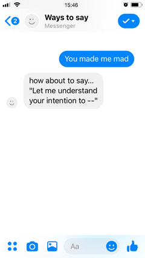

# How can I make Facebook chatbot?
This document will shares what I referred during this [facebook messenger chatbot](https://yukinokoh.github.io/ways2say/)  development for an intermediate level engineers.

Besides, here is [start guide](https://developers.facebook.com/docs/messenger-platform/getting-started) from facebook, which was helpful!

### 1. Write a Webhook
Webhook is a javascript file to which we will write how the chatbot response to the users. Firstly at this step..  
- Write a webhook to test HTTP server functions with your local server: [Facebook Developer doc](https://developers.facebook.com/docs/messenger-platform/getting-started/webhook-setup)

### 2. Deploy the webhook to your favourite server
This step is to define URL that hosts the webhook. I use Google Cloud Platform, particularly Cloud function.

- Modify network requesting part in the webhook for the server: [GCP sample to handle multiple HTTP methods](https://cloud.google.com/functions/docs/writing/http)
- Upload the file to the server: [GCP Cloud function deploy](https://cloud.google.com/functions/docs/tutorials/http)
- Debug...: [GC function log](https://cloud.google.com/functions/docs/monitoring/logging)

### 3. Setting up the app at Facebook developer account page
This step is to set app the chatbot app. 
- [Facebook developer doc](https://developers.facebook.com/docs/messenger-platform/getting-started/app-setup)

### 4. Write chatbot logics to the webhook
- [Facebook developer doc](https://developers.facebook.com/docs/messenger-platform/getting-started/quick-start)
- About process.env in this [medium article](https://codeburst.io/process-env-what-it-is-and-why-when-how-to-use-it-effectively-505d0b2831e7)
- [sample webhook](sample/sample-webhook.js)

### 5. Activate the app!
Finally we can activate the app after providing the following information.
- Data policy: which data to retrieve and for what? etc Need to be hosted in public URL
- Terms of Service: what is this service offer? etc. Need to be hosted in public URL
- The data retriever info: Legally required in EU and in this case we need to provid in the developer account page.
- Finally activate your app in the account page :)

### Optional: Train the dataset
I found [wit.ai](https://wit.ai) is helpful to compose the logic, because
- It has their pre-trained dataset 
- It provide function to train the dataset with the retrieved user response after connecting with app in the developer account page 

© [Yukino Kohmoto](http://yukinokoh.github.io/)
